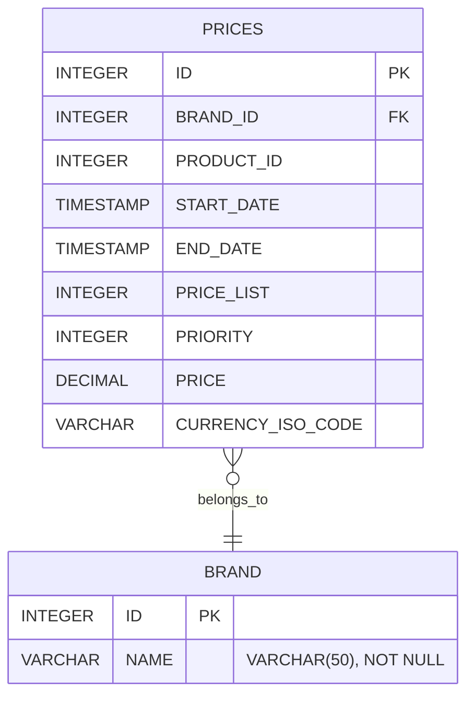

# Pricing Service

Servicio REST para consultar el precio aplicable a un producto y una marca en
una fecha determinada. El proyecto utiliza Java 21 y Spring Boot 4.1.1,
siguiendo arquitectura hexagonal y un enfoque API First.

La API HTTP está definida mediante OpenAPI. La interfaz de la API y los DTOs
se generan a partir de este contrato, mientras que la implementación del
servicio se encarga de conectar la API con el caso de uso, el dominio y la
persistencia.

## Funcionalidad

La API devuelve el precio aplicable cuando existe exactamente una configuración
válida para:

- `productId`
- `brandId`
- una fecha dentro del intervalo inclusivo
  (`startDate <= applicationDate <= endDate`);
- la prioridad más alta entre los precios aplicables.

Si no existe ningún precio se devuelve `PRICE_NOT_FOUND`. Si varios precios
con la prioridad más alta empatan, la configuración es ambigua y se devuelve
`DUPLICATED_PRICE`, en lugar de elegir un resultado arbitrariamente.

## Requisitos

- JDK 21.
- No es necesario instalar Maven globalmente: el Maven Wrapper usa Maven
  3.9.16 y descarga la distribución configurada si hace falta.
- Acceso a Maven Central durante la primera ejecución para descargar Maven y
  las dependencias del proyecto.

La versión de H2 no está fijada directamente en `pom.xml`: la dependencia se
declara en tiempo de ejecución y su versión la gestiona Spring Boot 4.1.1.

## Tecnologías y responsabilidad

| Tecnología | Uso en la solución |
|---|---|
| Java 21 | Lenguaje utilizado para desarrollar la aplicación. |
| Spring Boot 4.1.1 | Arranque, configuración y composición de la aplicación. |
| Spring Web MVC | Exposición del endpoint HTTP y gestión del ciclo de petición. |
| Spring Data JPA / Hibernate | Acceso a la base de datos mediante repositorios, query JPQL y mapeo de entidades. |
| H2 (versión gestionada por Spring Boot) | Base de datos en memoria para ejecución local y tests; no pretende ser la base de producción. |
| OpenAPI 3.0.3 | Contrato de la API, incluyendo operaciones, parámetros, respuestas y esquemas. |
| OpenAPI Generator 7.21.0 | Generación de `PricingApi` y de los DTOs HTTP durante `generate-sources`. |
| MapStruct 1.6.3 | Conversión entre modelos de infraestructura/dominio y entre dominio y DTO de respuesta. |
| Lombok | Reducción de código repetitivo, principalmente en constructores requeridos. |
| Spring AOP | Logging transversal de ejecución de casos de uso y adapters. |
| Maven Wrapper 3.3.4 / Maven 3.9.16 | Descarga y ejecuta la versión de Maven configurada por el proyecto. |
| JUnit 5, Mockito, AssertJ y Spring Boot Test | Tests unitarios, de integración y de persistencia. |
| JaCoCo | Generación del informe de cobertura durante `verify`. |

## Arquitectura

La aplicación está organizada siguiendo arquitectura hexagonal:

- **`domain`** contiene `Price` y el value object `ValidityPeriod`. No depende
  de Spring, JPA, HTTP ni de clases generadas.
- **`application`** contiene el caso de uso, los puertos de entrada y salida y
  las excepciones funcionales. Depende del dominio y de abstracciones propias.
- **`infrastructure`** contiene los adapters y detalles tecnológicos:
  configuración Spring, API, logging y persistencia JPA.
- **`infrastructure.in.web`** contiene `PricingController`, filtros,
  excepciones y el mapper HTTP. `PricingController` implementa la interfaz
  generada `PricingApi` y delega en el puerto de entrada.
- **`infrastructure.out.persistence.jpa`** contiene `PriceEntity`,
  `PriceJpaRepository`, `PriceEntityMapper` y
  `PriceQueryPersistenceAdapter`, que implementa `PriceQueryPort`.
- La interfaz `PricingApi` y los DTOs se generan en el paquete
  `adapter.in.web` bajo `target/generated-sources/openapi`; no son código
  mantenido manualmente en `src/main/java`.

La dirección de las dependencias apunta hacia el dominio. La aplicación define
los puertos; infraestructura los implementa. `ApplicationConfig` realiza la
composición del caso de uso sin hacer que la aplicación conozca Spring o JPA.

## API First y contrato HTTP

El contrato se encuentra en
[`src/main/resources/openapi/openapi-rest.yaml`](src/main/resources/openapi/openapi-rest.yaml).
No se deben editar manualmente los DTOs o interfaces generados: cualquier
cambio del contrato debe realizarse primero en OpenAPI y después regenerarse
durante el build.

### Consultar el precio aplicable

```http
GET /api/v1/prices
```

Parámetros query obligatorios:

| Parámetro | Tipo | Descripción |
|---|---|---|
| `applicationDate` | `LocalDateTime` | Fecha y hora local, sin zona horaria. Ejemplo: `2020-06-14T16:00:00`. |
| `productId` | `Integer` | Identificador del producto. |
| `brandId` | `Integer` | Identificador de la marca o cadena. |

Ejemplo:

```text
GET http://localhost:8080/api/v1/prices?applicationDate=2020-06-14T16:00:00&productId=35455&brandId=1
```

Respuesta `200 OK`:

```json
{
  "productId": 35455,
  "brandId": 1,
  "priceList": 2,
  "startDate": "2020-06-14T15:00:00",
  "endDate": "2020-06-14T18:30:00",
  "price": 25.45
}
```

Las fechas se representan mediante `LocalDateTime`, ya que los campos
`START_DATE` y `END_DATE` se almacenan sin información de zona horaria.
No se utiliza `OffsetDateTime` ni `ZonedDateTime` porque el modelo de datos no
proporciona un offset ni una zona con los que trabajar. La respuesta contiene
los campos `productId`, `brandId`, `priceList`, `startDate`, `endDate` y
`price`; este contrato no expone `currencyIsoCode`.

Ejemplo con `curl`:

```bash
curl "http://localhost:8080/api/v1/prices?applicationDate=2020-06-14T16:00:00&productId=35455&brandId=1" \
  -H "Accept: application/json" \
  -H "Accept-Language: en"
```

## Modelo y decisiones de dominio

`Price` representa el precio aplicable en el dominio. `ValidityPeriod` agrupa las
fechas como un value object reutilizable implementado como `record`. Por
decisión actual, no impone invariantes adicionales. La comparación del
intervalo y la selección por prioridad se realizan en la query y el caso de
uso, respectivamente.

## Persistencia y selección

La tabla `PRICES` y la tabla `BRAND` se crean desde
`src/main/resources/sql/schema.sql`; los datos locales de ejemplo se cargan
desde `src/main/resources/sql/data.sql`. `PriceEntity` representa la tabla
`PRICES`; `PriceEntityMapper` convierte la entidad JPA al modelo de dominio.

### Diagrama de base de datos



`PriceJpaRepository` filtra los candidatos aplicables por producto, marca e
intervalo temporal inclusivo:

```text
PRODUCT_ID = productId
BRAND_ID = brandId
START_DATE <= applicationDate
END_DATE >= applicationDate
```

Los resultados se ordenan por prioridad descendente:

```sql
ORDER BY PRODUCT_ID, BRAND_ID, PRIORITY DESC
```

Aunque producto y marca ya están fijados por los filtros de igualdad, se
conservan ambos campos en el `ORDER BY` tal como está definido en la query.
`PriceQueryPersistenceAdapter` pasa `Limit.of(2)` al repository, que genera
una consulta SQL con el equivalente a:

```sql
FETCH FIRST 2 ROWS ONLY
```

Se obtienen hasta dos filas, no una, para distinguir entre una única
configuración y un empate en la prioridad más alta. El UseCase interpreta los
resultados así:

| Resultados | Comportamiento |
|---|---|
| 0 | No existe precio aplicable; lanza `PRICE_NOT_FOUND`. |
| 1 | Devuelve ese precio. |
| 2 con distinta `PRIORITY` | Devuelve el primero, que tiene mayor prioridad por el orden del repository. |
| 2 con igual `PRIORITY` | Hay empate en la prioridad más alta; lanza `DUPLICATED_PRICE`. |

El límite de dos también basta cuando hay más de dos empates: los dos primeros
ya evidencian el conflicto. No se necesita recuperar ni mapear el resto de las
filas empatadas.

El esquema crea este índice:

```sql
CREATE INDEX IDX_PRICES_PRIORITY
ON PRICES (PRODUCT_ID, BRAND_ID, PRIORITY DESC);
```

Sus columnas iniciales corresponden a los filtros de igualdad por producto y
marca, y la siguiente columna está ordenada en la misma dirección que la
prioridad solicitada. Por eso el índice está alineado con los filtros y el
ordenamiento de la consulta. El índice
no garantiza por sí solo un plan o una mejora de rendimiento para cualquier
motor o volumen de datos; debe validarse con el motor y los datos del entorno
de despliegue.

El esquema también define una FK de `PRICES.BRAND_ID` a `BRAND.ID`,
columnas obligatorias y restricciones `CHECK` para evitar intervalos
invertidos y precios negativos.

## Errores e internacionalización

Los errores se devuelven con el esquema `ErrorResponse` generado desde OpenAPI.
El handler global traduce excepciones funcionales, errores de validación de
parámetros y errores inesperados:

| Situación | HTTP | Código |
|---|---:|---|
| No existe precio aplicable | 404 | `PRICE-001` |
| Empate de prioridad para la fecha consultada | 500 | `PRICE-002` |
| Falta un parámetro requerido | 400 | `MISSING_PARAMETER` |
| Formato de parámetro inválido | 400 | `INVALID_PARAMETER` |
| Error no contemplado | 500 | `INTERNAL_ERROR` |

Los mensajes se resuelven mediante `MessageSource` usando
`messages.properties`, `messages_en.properties` y `messages_es.properties`.
El locale de la petición se puede enviar mediante la cabecera `Accept-Language`.

## Logging

`HttpLoggingFilter` registra método, URI, query, headers permitidos, estado,
respuesta y duración. Genera un `requestId` y lo mantiene en el MDC durante la 
petición para identificar y correlacionar todos los logs asociados a una misma 
petición, facilitando el seguimiento de una solicitud a través de las distintas 
capas de la aplicación.. No registra `Authorization`, cookies, contraseñas ni 
tokens.

`LoggingAspect` registra argumentos, resultado o error y duración de los casos
de uso y del adapter de consulta de persistencia.

## Configuración y ejecución local

La configuración principal está en `src/main/resources/application.yml`:

- H2 en memoria con URL `jdbc:h2:mem:pricingdb`
- usuario `sa` y contraseña vacía
- ejecución de `schema.sql` y `data.sql`
- `ddl-auto: none`, para que el esquema sea explícito y versionado
- consola H2 habilitada en `/api/h2-console`
- context path `/api`

La consola H2 está habilitada por la configuración actual y es una ayuda de
desarrollo; no debe exponerse en un entorno productivo. Del
mismo modo, H2 y los scripts de datos de ejemplo no son una decisión de
producción.

Iniciar la aplicación:

```bash
./mvnw spring-boot:run
```

En Windows:

```powershell
.\mvnw.cmd spring-boot:run
```

La API queda disponible en
`http://localhost:8080/api/v1/prices`.

## Tests y build

El perfil de test usa una base H2 independiente
(`jdbc:h2:mem:pricingdb-test`) y carga `schema.sql` y
`src/test/resources/sql/test-data.sql`.

Los tests usan el mismo esquema de tablas e índice que la aplicación. Los
registros del SQL de test con `PRODUCT_ID=35455` y `BRAND_ID=1` cubren los
cinco escenarios funcionales originales:

| Fecha de aplicación | `priceList` | `price` |
|---|---:|---:|
| 14/06/2020 10:00 | 1 | 35.50 |
| 14/06/2020 16:00 | 2 | 25.45 |
| 14/06/2020 21:00 | 1 | 35.50 |
| 15/06/2020 10:00 | 3 | 30.50 |
| 16/06/2020 21:00 | 4 | 38.95 |

Los registros de prueba 7 y 8 crean un empate de prioridad para verificar el
conflicto. `PriceJpaRepositoryTest` añade una tercera fila durante una prueba
para comprobar que el repository sigue devolviendo como máximo dos
candidatos.

La suite incluye tests unitarios del UseCase, tests de repository con H2,
tests de integración HTTP del controller, y tests de mappers, excepciones y
logging.

Ejecutar tests:

```bash
./mvnw test
```

En Windows:

```powershell
.\mvnw.cmd test
```

Construir el artefacto:

```bash
./mvnw package
```

En Windows:

```powershell
.\mvnw.cmd package
```

El informe de cobertura JaCoCo se genera en la fase `verify`:

```bash
./mvnw verify
```

## Estructura del proyecto

```text
src/
├── main/
│   ├── java/com/lsp/pricingservice/
│   │   ├── application/
│   │   │   ├── exception/
│   │   │   ├── port/in/
│   │   │   ├── port/out/
│   │   │   └── usecase/
│   │   ├── domain/model/
│   │   │   └── vo/
│   │   └── infrastructure/
│   │       ├── config/
│   │       ├── in/web/
│   │       │   ├── exception/
│   │       │   ├── filter/
│   │       │   └── mapper/
│   │       ├── logging/
│   │       └── out/persistence/jpa/
│   │           ├── adapter/
│   │           ├── entity/
│   │           ├── mapper/
│   │           └── repository/
│   └── resources/
│       ├── openapi/openapi-rest.yaml
│       ├── sql/
│       ├── application.yml
│       └── messages*.properties
├── test/
│   ├── java/com/lsp/pricingservice/
│   └── resources/
│       ├── application-test.yml
│       └── sql/test-data.sql
└── target/generated-sources/openapi/
    └── com/lsp/pricingservice/adapter/in/web/
        ├── api/
        └── dto/
```

## Asunciones y alcance

- La fecha de aplicación no tiene zona horaria ni conversión entre zonas.
- Los intervalos son inclusivos en ambos extremos.
- Un empate en la prioridad más alta es un conflicto funcional y no
  se resuelve aplicando un criterio arbitrario.
- El servicio es de consulta; no incluye endpoints de alta, modificación o
  administración de precios.
- La configuración incluida está orientada al desarrollo local. Aspectos
  como la base de datos, la observabilidad, la seguridad de las comunicaciones
  y la gestión de secretos deberían revisarse y adaptarse a los requisitos del entorno de producción.
