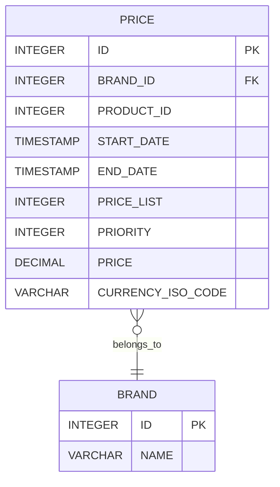

# Pricing Service

Servicio REST para consultar el precio aplicable a un producto y una marca en
una fecha determinada. El proyecto utiliza Java
21 y Spring Boot 4.1.1, siguiendo arquitectura hexagonal y un enfoque API
First.

La API HTTP está definida mediante OpenAPI. La interfaz de la API y los DTOs 
se generan a partir de este contrato, mientras que la implementación del 
servicio se encarga de conectar la API con el caso de uso, el dominio y la 
persistencia.

## Funcionalidad

La API devuelve el precio aplicable cuando existe exactamente una configuración
válida para:

- `productId`;
- `brandId`;
- una fecha dentro del intervalo inclusivo
  (`startDate <= applicationDate <= endDate`);
- la prioridad máxima entre los precios aplicables.

Si no existe ningún precio se devuelve `PRICE_NOT_FOUND`. Si varias filas
comparten la prioridad máxima, la configuración es ambigua y se devuelve
`DUPLICATED_PRICE`, en lugar de elegir un resultado arbitrariamente.

## Tecnologías y responsabilidad

| Tecnología | Uso en la solución |
|---|---|
| Java 21 | Lenguaje utilizado para desarrollar la aplicación. |
| Spring Boot 4.1.1 | Arranque, configuración y composición de la aplicación. |
| Spring Web MVC | Exposición del endpoint HTTP y gestión del ciclo de petición. |
| Spring Data JPA / Hibernate | Acceso a la base de datos mediante repositorios, query JPQL y mapeo de entidades. |
| H2 | Base de datos en memoria para ejecución local y tests; no pretende ser la base de producción. |
| OpenAPI 3.0.3 | Contrato de la API, incluyendo operaciones, parámetros, respuestas y esquemas. |
| OpenAPI Generator 7.21.0 | Generación de `PricingAPI` y de los DTOs HTTP durante `generate-sources`. |
| MapStruct 1.6.3 | Conversión entre modelos de infraestructura/dominio y entre dominio y DTO de respuesta. |
| Lombok | Reducción de código repetitivo, principalmente en constructores requeridos. |
| Spring AOP | Logging transversal de ejecución de casos de uso y adapters. |
| Maven Wrapper | Ejecución reproducible de Maven sin requerir una instalación global. |
| JUnit 5, Mockito, AssertJ y Spring Boot Test | Tests unitarios, de integración y de persistencia. |
| JaCoCo | Generación del informe de cobertura durante `verify`. |

## Arquitectura

La aplicación está organizada siguiendo arquitectura hexagonal:

- **`domain`** contiene `Price` y el value object `ValidityPeriod`. No depende
  de Spring, JPA, HTTP ni de clases generadas.
- **`application`** contiene el caso de uso, los puertos de entrada y salida y
  las excepciones funcionales. Depende del dominio y de abstracciones propias.
- **`infrastructure`** contiene los adapters y detalles tecnológicos:
  configuración Spring, API, logging y persistencia JPA.
- **`adapter.in.web`** contiene la interfaz y los DTOs generados desde OpenAPI.
  `PricingController` implementa la interfaz generada y delega en el puerto de
  entrada.
- **`adapter.out.persistence.jpa`** contiene `PriceEntity`,
  `PriceJpaRepository` y `PriceQueryPersistenceAdapter`, que implementa
  `PriceQueryPort`.

La dirección de las dependencias apunta hacia el dominio. La aplicación define
los puertos; infraestructura los implementa. `ApplicationConfig` realiza la
composición del caso de uso sin hacer que la aplicación conozca Spring o JPA.

## API First y contrato HTTP

El contrato se encuentra en
[`src/main/resources/openapi/openapi-rest.yaml`](src/main/resources/openapi/openapi-rest.yaml).
No se deben editar manualmente los DTOs o interfaces generados: cualquier
cambio del contrato debe realizarse primero en OpenAPI y después regenerarse
durante el build.

### Consultar el precio aplicable

```http
GET /api/v1/prices
```

Parámetros query obligatorios:

| Parámetro | Tipo | Descripción |
|---|---|---|
| `applicationDate` | `LocalDateTime` | Fecha y hora local, sin zona horaria. Ejemplo: `2020-06-14T16:00:00`. |
| `productId` | `Integer` | Identificador del producto. |
| `brandId` | `Integer` | Identificador de la marca o cadena. |

Ejemplo:

```text
GET http://localhost:8080/api/v1/prices?applicationDate=2020-06-14T16:00:00&productId=35455&brandId=1
```

Respuesta `200 OK`:

```json
{
  "productId": 35455,
  "brandId": 1,
  "priceList": 2,
  "startDate": "2020-06-14T15:00:00",
  "endDate": "2020-06-14T18:30:00",
  "price": 25.45
}
```

Las fechas se representan mediante `LocalDateTime`, ya que los campos
`START_DATE` y `END_DATE` se almacenan sin información de zona horaria.
No se utiliza OffsetDateTime ni ZonedDateTime porque el modelo de datos no 
proporciona un offset ni una zona con los que trabajar.

## Modelo y decisiones de dominio

`Price` representa el precio aplicable en el dominio. `ValidityPeriod` agrupa las fechas como
un value object reutilizable y se modela como `record`. Por decisión actual,
este value object no impone invariantes adicionales; la inclusión temporal y
la selección por prioridad se resuelven en la consulta de precios.


## Persistencia y selección

La tabla `PRICES` se crea desde `src/main/resources/sql/schema.sql` y los datos
de ejemplo desde `src/main/resources/sql/data.sql`. `PriceEntity` representa
la persistencia; `PriceEntityMapper` evita que esa entidad llegue al dominio.

### Diagrama de base de datos



`PriceJpaRepository` aplica en base de datos todos los criterios de la
consulta: producto, marca, intervalo inclusivo y prioridad máxima. El adapter
solicita como máximo dos candidatos:

- cero resultados permite distinguir `PRICE_NOT_FOUND`;
- un resultado permite devolver el precio;
- dos resultados son suficientes para detectar una duplicidad.

El límite evita recuperar y procesar un número arbitrario de registros cuando
existen varios precios con la misma prioridad máxima. No pretende
evitar que la base de datos tenga que calcular la prioridad máxima sobre las
filas candidatas.

## Errores e internacionalización

Los errores se devuelven con el esquema `ErrorResponse` generado desde OpenAPI.
El handler global traduce excepciones funcionales, errores de validación de
parámetros y errores inesperados:

| Situación | HTTP | Código |
|---|---:|---|
| No existe precio aplicable | 404 | `PRICE-001` |
| Configuración duplicada en máxima prioridad | 500 | `PRICE-002` |
| Falta un parámetro requerido | 400 | `MISSING_PARAMETER` |
| Formato de parámetro inválido | 400 | `INVALID_PARAMETER` |
| Error no contemplado | 500 | `INTERNAL_ERROR` |

Los mensajes se resuelven mediante `MessageSource` usando
`messages.properties`, `messages_en.properties` y `messages_es.properties`.
El locale puede seleccionarse con `Accept-Language`.

## Logging

`HttpLoggingFilter` registra método, URI, query, headers permitidos, estado,
respuesta y duración. Genera un `requestId` y lo mantiene en el MDC durante la 
petición para identificar y correlacionar todos los logs asociados a una misma 
petición, facilitando el seguimiento de una solicitud a través de las distintas 
capas de la aplicación.. No registra `Authorization`, cookies, contraseñas ni 
tokens.

`LoggingAspect` registra argumentos, resultado o error y duración de los casos
de uso y del adapter de consulta de persistencia. El logging transversal se
mantiene separado de la lógica de negocio.

## Configuración y ejecución local

La configuración principal está en `src/main/resources/application.yml`:

- H2 en memoria con URL `jdbc:h2:mem:pricingdb`;
- usuario `sa` y contraseña vacía;
- ejecución de `schema.sql` y `data.sql`;
- `ddl-auto: none`, para que el esquema sea explícito y versionado;
- consola H2 habilitada en `/api/h2-console`;
- context path `/api`.

La consola H2 es una ayuda de desarrollo y no debe exponerse en
un entorno productivo. Del mismo modo, H2 y los scripts de datos de ejemplo
no son una decisión de producción.

Iniciar la aplicación:

```bash
./mvnw spring-boot:run
```

En Windows:

```powershell
.\mvnw.cmd spring-boot:run
```

La API queda disponible en
`http://localhost:8080/api/v1/prices`.

## Tests y build

El perfil de test usa una base H2 independiente
(`jdbc:h2:mem:pricingdb-test`) y carga `schema.sql` y
`src/test/resources/sql/test-data.sql`.

La suite está separada por responsabilidad:

- **unit tests** para el caso de uso, mappers y componentes sin contexto
  completo;
- **repository tests** para la query JPA, los intervalos inclusivos, prioridad
  máxima y empates;
- **integration tests** para el controller y el contrato HTTP, incluyendo
  parámetros inválidos y respuestas de error.

Ejecutar tests:

```bash
./mvnw test
```

En Windows:

```powershell
.\mvnw.cmd test
```

Construir el artefacto y generar el informe de cobertura:

```bash
./mvnw verify
```

## Estructura del proyecto

```text
src/
├── main/
│   ├── java/com/lsp/pricingservice/
│   │   ├── application/
│   │   │   ├── exception/
│   │   │   ├── port/in/
│   │   │   ├── port/out/
│   │   │   └── usecase/
│   │   ├── domain/model/
│   │   │   └── vo/
│   │   └── infrastructure/
│   │       ├── config/
│   │       ├── in/web/
│   │       │   ├── exception/
│   │       │   ├── filter/
│   │       │   └── mapper/
│   │       ├── logging/
│   │       └── out/persistence/jpa/
│   │           ├── adapter/
│   │           ├── entity/
│   │           ├── mapper/
│   │           └── repository/
│   └── resources/
│       ├── openapi/openapi-rest.yaml
│       ├── sql/
│       ├── application.yml
│       └── messages*.properties
└── test/
    ├── java/com/lsp/pricingservice/
    └── resources/
        ├── application-test.yml
        └── sql/test-data.sql
```

## Asunciones y alcance

- Los identificadores de producto y marca se reciben como enteros.
- La fecha de aplicación no tiene zona horaria ni conversión entre zonas.
- Los intervalos son inclusivos en ambos extremos.
- Una duplicidad en la prioridad máxima es una inconsistencia funcional y no
  se resuelve aplicando un criterio arbitrario.
- El servicio es de consulta; no incluye endpoints de alta, modificación o
  administración de precios.
- La configuración incluida está orientada al desarrollo local. Aspectos 
  como la base de datos, la observabilidad, la seguridad de las comunicaciones 
  y la gestión de secretos deberían revisarse y adaptarse a los requisitos del entorno de producción.
